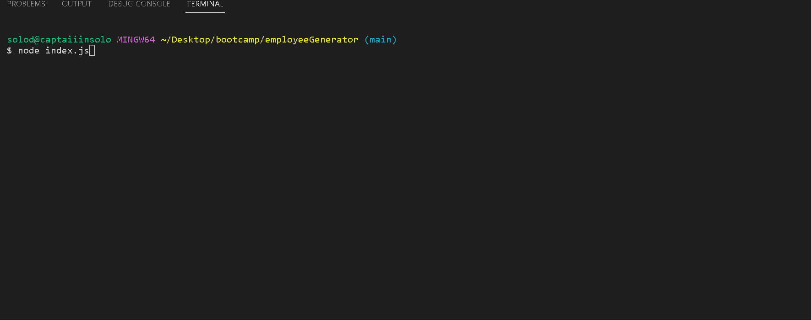

# Employee Generator

## Table of Contents
- [Employee Generator](#employee-generator)
  - [Table of Contents](#table-of-contents)
  - [Technology Used](#technology-used)
  - [Description](#description)
  - [Usage](#usage)
  - [Installation](#installation)
  - [License](#license)
  - [Learning Points](#learning-points)
  - [Author Info](#author-info)


## Technology Used
| Technology Used     |                            Resource URL                             |
| ------------------- | :-----------------------------------------------------------------: |
| HTML                |   [MDN - HTML](https://developer.mozilla.org/en-US/docs/Web/HTML)   |
| JavaScript          | [MDN - JS](https://developer.mozilla.org/en-US/docs/Web/JavaScript) |
| Git                 |                     [Git](https://git-scm.com/)                     |
| Node                |              [Node Docs](https://nodejs.org/en/docs/)               |
| Inquirer 8.2.4      |   [Inquirer Docs](https://www.npmjs.com/package/inquirer/v/8.2.4)   |
| Bulma CSS Framework |            [Bulma Docs](https://bulma.io/documentation/)            |
| NPM                 |                 [NPM Docs](https://docs.npmjs.com/)                 |

## Description
For this project I was asked to create an employee generator for a growing company. The application uses Node JS to ask the client a series of questions from the command line in order to generate contact cards for the specified employee. After the client is finished with the prompt, the contact cards will dynamically append on the myTeam.html file located in the dist directory.

## Usage



## Installation

- npm i
- npm i inquirer@8.2.4
- npm i bulma

## License

Please see [GitHub Repo](https://github.com/captaiiinsolo/employeeGenerator) for license information.

## Learning Points

This code snippet is how I was able to dynamically render the users responses to the corresponding HTML sections using their template literals. 

```
// HTML page layout
const genHTML = (response) => {
// generate manager card
const genManager = (responseManager) => {
    return `
    <div class="column is-one-third">
        <div class="hero is-info is-small has-text-centered">
            <div class="hero-body">
                <p class="title is-4">${responseManager.name}</p>
                <p class="subtitle is-4">Manager</p>
            </div>
        </div>

    <div class="card">
        <div class="card-content">
            <p class="subtitle is-5"><i class="fa-solid fa-id-badge m-2 p-2"></i> <span>${responseManager.id}</span> </p>
            <p class="subtitle is-5"><i class="fa-solid fa-envelope m-2 p-2"></i> <span><a href="mailto:${responseManager.email}">${responseManager.email}</a></span> </p>
            <p class="subtitle is-5"><i class="fa-solid fa-phone m-2 p-2"></i> <span><a href="tel:${responseManager.office}">${responseManager.office}</a></span> </p>
        </div>
    </div>
</div>
`;
};

// generate engineer card
const genEngineer = (responseEngineer) => {
    return `
    <div class="column is-one-third">
    <div class="hero is-info is-small has-text-centered">
        <div class="hero-body">
            <p class="title is-4">${responseEngineer.name}</p>
            <p class="subtitle is-4">Engineer</p>
        </div>
    </div>

    <div class="card">
        <div class="card-content">
            <p class="subtitle is-5"><i class="fa-solid fa-id-badge m-2 p-2"></i> <span>${responseEngineer.id}</span> </p>
            <p class="subtitle is-5"><i class="fa-solid fa-envelope m-2 p-2"></i> <span><a href="mailto:${responseEngineer.email}">${responseEngineer.email}</a></span> </p>
            <p class="subtitle is-5"><i class="fa-brands fa-github m-2 p-2"></i> <span>${responseEngineer.git}</span> </p>
        </div>
    </div>
</div>
`;
};

// generate intern card
const genIntern = (responseIntern) => {
    return `
    <div class="column is-one-third">
    <div class="hero is-info is-small has-text-centered">
        <div class="hero-body">
            <p class="title is-4">${responseIntern.name}</p>
            <p class="subtitle is-4">Intern</p>
        </div>
    </div>

    <div class="card">
        <div class="card-content">
            <p class="subtitle is-5"><i class="fa-solid fa-id-badge m-2 p-2"></i> <span>${responseIntern.id}</span> </p>
            <p class="subtitle is-5"><i class="fa-solid fa-envelope m-2 p-2"></i> <span><a href="mailto:${responseIntern.email}">${responseIntern.email}</a></span> </p>
            <p class="subtitle is-5"><i class="fa-solid fa-school m-2 p-2"></i> <span>${responseIntern.school}</span> </p>
        </div>
    </div>
</div>
`;
};
```

## Author Info

Solomon Santos is currently a student at the UC Berkeley Full Stack Coding Boot Camp. He is expected to gradaute in March 2023. Feel free to reach out to him via any of the social channels below.

- [LinkedIn](https://www.linkedin.com/in/solomon-santos)
- [GitHub](https://www.github.com/captaiiinsolo)
- [Twitter](https://twitter.com/captaiiinsolo)